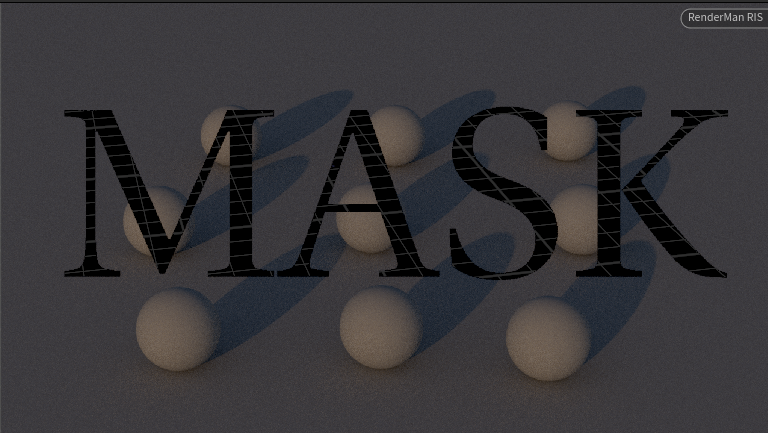

# PxrMaskProjection

A workround for non-rectangular region rendering

Tested with:

- Pixar RenderMan **27.2**
- Houdini **21.0.559**
- Windows 11 (MSVC v143) and Linux (g++)



## How it works

`PxrMaskProjection` is a full camera-replacement projection plugin
(`RixProjection`). For every screen sample hdPrman hands us, the
plugin:

1. Generates a perspective ray with FOV).
2. Looks up the corresponding UV in the mask EXR (bilinear).
3. If the mask value is ≤ `threshold`, fires a degenerate ray
   (`maxDist = 0`, `tint = 0`) so the integrator takes the miss
   path and writes true black without shading.

The EXR loader uses the bundled [tinyexr](https://github.com/syoyo/tinyexr)
single-header library, so the plugin does **not** link against
Houdini's or the system's OpenEXR — that avoids ABI-drift crashes
seen when loading against the DCC's own `OpenEXR_sidefx.dll` /
`libOpenEXR.so`.

## Features

- EXR mask loading by channel name (R, G, B, A, or custom)
- `maskFit`: Stretch / Fill / Fit
- `centerX`, `centerY`: pan the mask in screen space
- `invert`: swap black and white
- `threshold`: position the binary cutoff (see note above)
- `debug`: verbose diagnostics in the render log


## Fetch dependencies
Third-party single-header libraries (`tinyexr`, `miniz`) are **not
vendored in the repo** — run `fetch_thirdparty.*` once after
cloning to download pinned versions into `thirdparty/`. The refs
are set at the top of the fetch scripts; bump them and re-run to
update.

Before the first build, download the single-header deps:

```bash
# Linux / macOS — needs curl + unzip
./fetch_thirdparty.sh
```

```bat
REM Windows — needs curl + tar (both ship with Windows 10+)
fetch_thirdparty.bat
```

This writes `thirdparty/tinyexr.h`, `exr_reader.hh`,
`streamreader.hh`, `miniz.h`, and `miniz.c`. Re-run after bumping
the pinned refs (`TINYEXR_REF`, `MINIZ_VER`) at the top of either
script.

## Build — Windows

1. Run `fetch_thirdparty.bat` (see above).
2. Install Visual Studio 2022+ with the "Desktop development with
   C++" workload (MSVC v143 / toolset 14.4x).
3. Edit the four path variables at the top of `build.bat` to match
   your system:

   ```bat
   set "RMANTREE=C:\path\to\RenderManProServer-27.2"
   set "MSVC=D:\...\VC\Tools\MSVC\14.44.35207"
   set "WINSDK=C:\Program Files (x86)\Windows Kits\10"
   set "WINSDK_VER=10.0.19041.0"
   ```

   `HFS` is not required to compile — tinyexr removes the OpenEXR
   dependency — but leave the variable in place if you want to
   experiment with the Houdini toolkit.

4. From a normal `cmd.exe` or Explorer double-click:

   ```
   build.bat
   ```

Output: `PxrMaskProjection.dll` in the repo root.

## Build — Linux

1. Run `./fetch_thirdparty.sh` (see above).
2. Install `g++` (or `clang++`), standard `libstdc++` with C++17.
3. Point `RMANTREE` at the install and run `build.sh`:

   ```bash
   export RMANTREE=/opt/pixar/RenderManProServer-27.2
   ./build.sh
   ```

Output: `PxrMaskProjection.so` in the repo root.

## Install

Copy the built library and the args file into RenderMan's plugin
folders:

| File | Destination | What it does |
|------|-------------|--------------|
| `PxrMaskProjection.dll` / `.so` | `$RMANTREE/lib/plugins/`      | The plugin code that RenderMan loads at render time. |

## Usage in Solaris

The projection lives on the **Render Settings** prim, not on the
Camera prim. Easiest way to set it up is via `set_projection.py`:

Raw USD equivalent (what the script writes):

```usda
def Scope "Render"
{
    def RenderSettings "rendersettings"
    {
        string ri:projection:name = "PxrMaskProjection"
        string ri:projection:PxrMaskProjection:maskFile    = "..."
        string ri:projection:PxrMaskProjection:maskChannel = "R"
        int    ri:projection:PxrMaskProjection:maskFit     = 0
        float  ri:projection:PxrMaskProjection:centerX     = 0.0
        float  ri:projection:PxrMaskProjection:centerY     = 0.0
        int    ri:projection:PxrMaskProjection:invert      = 0
        float  ri:projection:PxrMaskProjection:threshold   = 0.0
        float  ri:projection:PxrMaskProjection:fov         = 50.0
        int    ri:projection:PxrMaskProjection:debug       = 0
    }
}
```

## Parameters

| Name | Type | Default | Description |
|------|------|---------|-------------|
| `maskFile`    | string | `""` | Path to EXR mask image. |
| `maskChannel` | string | `"A"` | Channel name inside the EXR. |
| `maskFit`     | int    | `0` | `0`=Stretch, `1`=Fill, `2`=Fit. |
| `centerX`     | float  | `0.0` | Horizontal mask offset, screen-space `[-1, 1]`. |
| `centerY`     | float  | `0.0` | Vertical mask offset, screen-space `[-1, 1]`. |
| `invert`      | int    | `0` | `1` to invert the mask. |
| `threshold`   | float  | `0.0` | Mask values ≤ threshold are killed. |
| `fov`         | float  | `90.0` | **Scene-camera FOV along the narrower image dimension, in degrees.** Must match the Houdini camera. `set_projection.py` derives this automatically from the render camera's `focalLength` + aperture — you normally don't set it by hand. |
| `debug`       | int    | `0` | Verbose render-log output. |
